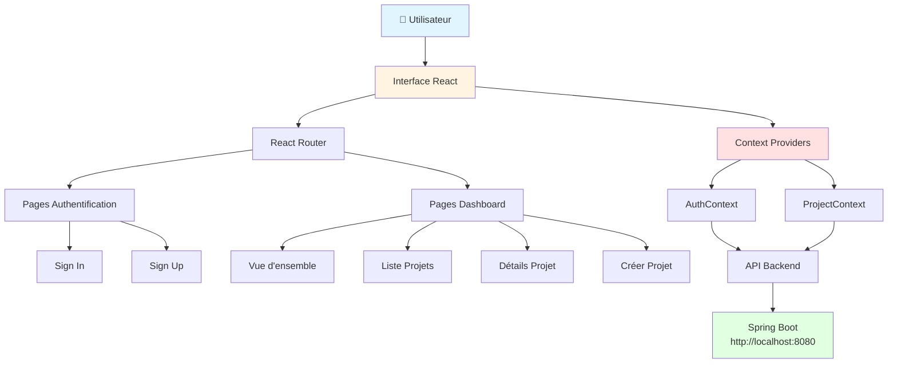
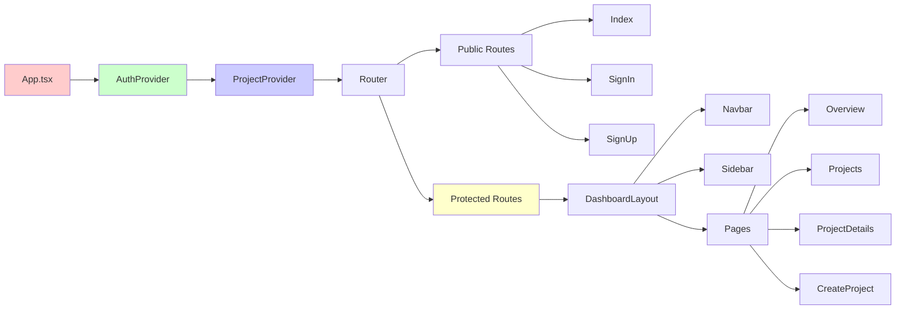
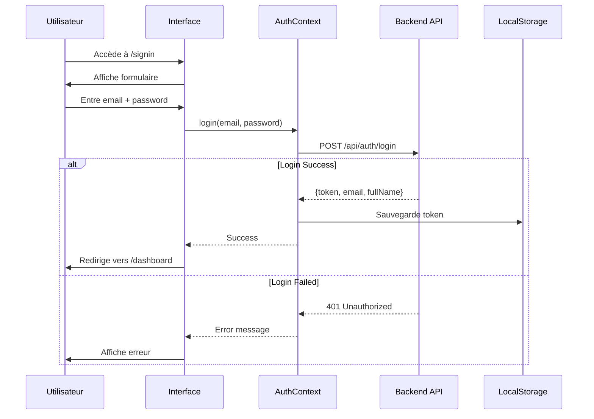
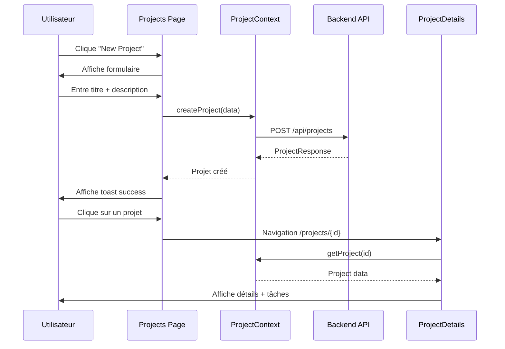
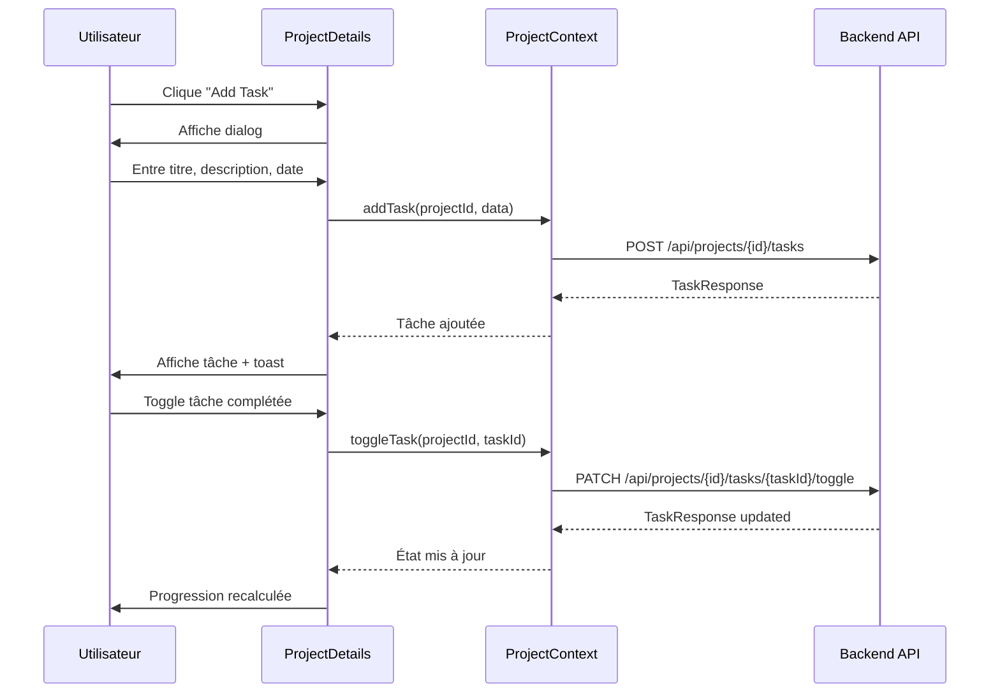
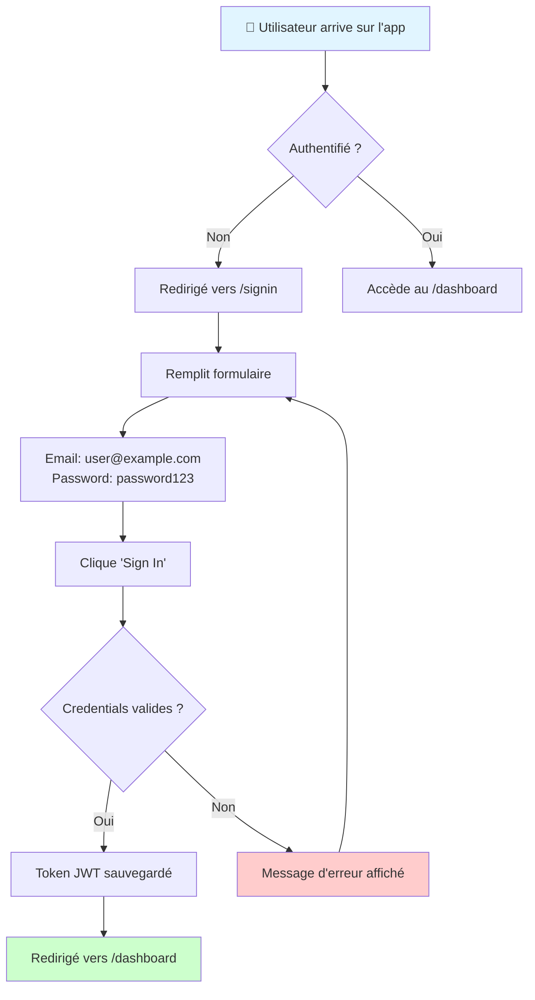
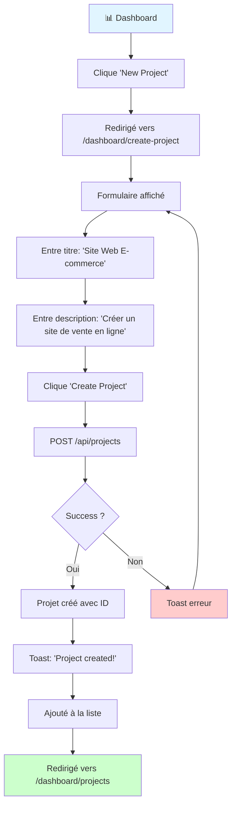
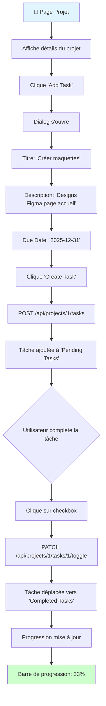
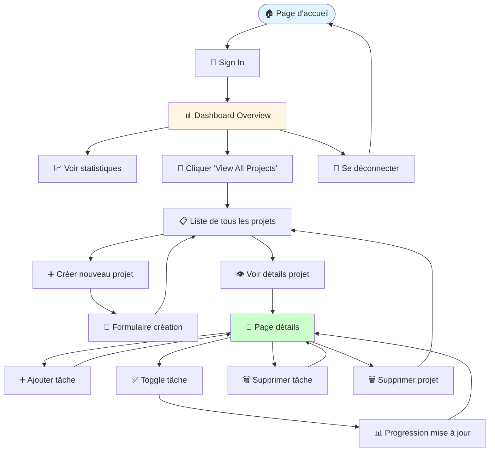

# 🎨 TaskFlow Frontend

Interface utilisateur moderne pour le système de gestion de tâches TaskManager, construite avec React et TypeScript.

## 📑 Table des matières

- [Vue d'ensemble](#vue-densemble)
- [Architecture](#architecture)
- [Technologies utilisées](#technologies-utilisées)
- [Installation](#installation)
- [Workflow utilisateur](#workflow-utilisateur)
- [Structure du projet](#structure-du-projet)
- [Composants principaux](#composants-principaux)
- [Exemples d'utilisation](#exemples-dutilisation)

---

## 🎯 Vue d'ensemble

**TaskFlow** est une application web moderne de gestion de projets et de tâches. Elle permet aux utilisateurs de :
- ✅ S'authentifier de manière sécurisée
- 📁 Créer et gérer des projets
- ✅ Ajouter et suivre des tâches
- 📊 Visualiser la progression en temps réel

---

## 🏗 Architecture

### Architecture Globale



### Architecture des Composants



---

## 🛠 Technologies utilisées

| Technologie | Version | Description |
|------------|---------|-------------|
| **React** | 18.3.1 | Bibliothèque UI |
| **TypeScript** | 5.8.3 | Typage statique |
| **Vite** | 7.3.0 | Build tool moderne |
| **React Router** | 6.30.1 | Navigation SPA |
| **TanStack Query** | 5.83.0 | Gestion d'état serveur |
| **React Hook Form** | 7.61.1 | Gestion de formulaires |
| **Zod** | 3.25.76 | Validation de schémas |
| **Tailwind CSS** | 3.4.17 | Framework CSS utilitaire |
| **shadcn/ui** | - | Composants UI (Radix UI) |
| **Lucide React** | 0.462.0 | Icônes |

---

## 🚀 Installation

### Prérequis

- Node.js 18+ ou Bun
- npm ou bun
- Backend Spring Boot en cours d'exécution sur `http://localhost:8080`

### Étapes d'installation

1. **Naviguer vers le dossier frontend**
   ```bash
   cd frontend
   ```

2. **Installer les dépendances**
   ```bash
   npm install
   # ou
   bun install
   ```

3. **Lancer le serveur de développement**
   ```bash
   npm run dev
   # ou
   bun dev
   ```

4. **Accéder à l'application**
   - Ouvrir `http://localhost:5173` dans votre navigateur

5. **Build pour la production** (optionnel)
   ```bash
   npm run build
   npm run preview
   ```

---

## 👤 Workflow utilisateur

### Flux d'authentification



### Flux de gestion de projet



### Flux de gestion de tâches



---

## 📁 Structure du projet

```
frontend/
├── public/                      # Assets statiques
├── src/
│   ├── components/             # Composants réutilisables
│   │   ├── ui/                # Composants shadcn/ui
│   │   │   ├── button.tsx
│   │   │   ├── card.tsx
│   │   │   ├── input.tsx
│   │   │   ├── progress.tsx
│   │   │   └── ...
│   │   ├── DashboardSidebar.tsx
│   │   ├── Navbar.tsx
│   │   ├── ProgressBar.tsx
│   │   ├── ProjectCard.tsx
│   │   ├── ProtectedRoute.tsx
│   │   └── TaskItem.tsx
│   │
│   ├── contexts/               # Context API
│   │   ├── AuthContext.tsx    # Authentification
│   │   └── ProjectContext.tsx # Gestion projets/tâches
│   │
│   ├── hooks/                  # Custom hooks
│   │   └── use-toast.ts
│   │
│   ├── lib/                    # Utilitaires
│   │   └── utils.ts
│   │
│   ├── pages/                  # Pages de l'application
│   │   ├── Dashboard/
│   │   │   ├── DashboardLayout.tsx
│   │   │   ├── Overview.tsx
│   │   │   ├── Projects.tsx
│   │   │   ├── ProjectDetails.tsx
│   │   │   └── CreateProject.tsx
│   │   ├── Index.tsx          # Page d'accueil
│   │   ├── SignIn.tsx         # Connexion
│   │   ├── SignUp.tsx         # Inscription
│   │   └── NotFound.tsx       # 404
│   │
│   ├── App.tsx                 # Composant racine
│   ├── main.tsx                # Point d'entrée
│   └── index.css               # Styles globaux
│
├── index.html                  # Template HTML
├── package.json                # Dépendances
├── tailwind.config.ts          # Config Tailwind
├── tsconfig.json               # Config TypeScript
└── vite.config.ts              # Config Vite
```

---

## 🧩 Composants principaux

### AuthContext

Gère l'état d'authentification global :
- Login/Logout
- Stockage du token JWT
- Récupération des informations utilisateur
- Protection des routes

```typescript
const { user, login, logout, isAuthenticated } = useAuth();
```

### ProjectContext

Gère l'état des projets et tâches :
- CRUD Projets
- CRUD Tâches
- Calcul de progression
- Cache local

```typescript
const { 
  projects, 
  createProject, 
  deleteProject,
  addTask, 
  toggleTask,
  getProjectProgress 
} = useProjects();
```

### ProtectedRoute

Composant de protection des routes nécessitant l'authentification :

```typescript
<ProtectedRoute>
  <DashboardLayout />
</ProtectedRoute>
```

---

## 📖 Exemples d'utilisation

### Exemple 1 : Se connecter



**Détails :**
1. L'utilisateur entre `user@example.com` et `password123`
2. Le système envoie une requête POST à `/api/auth/login`
3. Le backend renvoie un JWT token
4. Le token est stocké dans localStorage
5. L'utilisateur est redirigé vers le tableau de bord

---

### Exemple 2 : Créer un projet



**Résultat :**
- Un nouveau projet apparaît dans la grille avec :
  - Titre : "Site Web E-commerce"
  - Description : "Créer un site de vente en ligne"
  - Progression : 0% (0/0 tâches)

---

### Exemple 3 : Ajouter et gérer des tâches



**Scénario complet :**

1. **État initial du projet "Site Web E-commerce"**
   - Total tâches : 0
   - Complétées : 0
   - Progression : 0%

2. **Ajout de 3 tâches :**
   - ✅ "Créer maquettes" - Due: 2025-12-31
   - ✅ "Développer frontend" - Due: 2026-01-15
   - ✅ "Configurer backend" - Due: 2026-01-10

3. **Après ajout :**
   - Total tâches : 3
   - Complétées : 0
   - Progression : 0%

4. **L'utilisateur complète "Créer maquettes" :**
   - Clique sur la checkbox de la tâche
   - La tâche passe de "Pending" à "Completed"
   - Progression mise à jour : 33% (1/3)

5. **Visualisation :**
   ```
   ┌─────────────────────────────────────┐
   │  Site Web E-commerce                │
   │  ━━━━━━━━━━━━━━━━━━━━━━━━━━━━━━━  │
   │  Progress: ████████░░░░░░░░░░░░ 33% │
   │  1 of 3 tasks completed             │
   └─────────────────────────────────────┘
   
   Pending Tasks (2):
   ☐ Développer frontend (Due: Jan 15)
   ☐ Configurer backend (Due: Jan 10)
   
   Completed Tasks (1):
   ☑ Créer maquettes (Due: Dec 31)
   ```

---

### Exemple 4 : Navigation complète



---

## 🎨 Interface utilisateur

### Design System

**Couleurs :**
- Primary : Violet/Bleu pour les actions principales
- Success : Vert pour les tâches complétées
- Warning : Orange pour les tâches en attente
- Destructive : Rouge pour les actions de suppression

**Composants UI :**
- Buttons avec variantes (default, outline, ghost, destructive)
- Cards avec ombres subtiles
- Progress bars animées
- Dialogs et AlertDialogs pour les confirmations
- Toast notifications pour le feedback

---

## 🔒 Sécurité

- **Routes protégées** : Redirection automatique vers `/signin` si non authentifié
- **Token JWT** : Stocké de manière sécurisée dans localStorage
- **Expiration** : Gestion automatique de l'expiration du token
- **CORS** : Configuration correcte avec le backend

---

## 📦 Build et Déploiement

### Build de production

```bash
npm run build
```

Génère les fichiers optimisés dans `dist/`

### Variables d'environnement

Créer un fichier `.env` :

```env
VITE_API_URL=http://localhost:8080
```

### Déploiement

Compatible avec :
- Vercel
- Netlify
- GitHub Pages
- Tout hébergeur statique

---

## 🐛 Dépannage

### Problème : Impossible de se connecter au backend

**Solution :**
- Vérifier que le backend est démarré sur `http://localhost:8080`
- Vérifier la console pour les erreurs CORS

### Problème : Token expiré

**Solution :**
- Se reconnecter
- Le token JWT expire après 24h

---

## 👨‍💻 Développement

### Lancer en mode dev

```bash
npm run dev
```

### Linter

```bash
npm run lint
```

---

## 📄 Licence

Ce projet est sous licence MIT.

---

## 👥 Auteur

Développé par Mr.SALIM Haytem

---

**Version :** 1.0.0  
**Dernière mise à jour :** Décembre 2024
